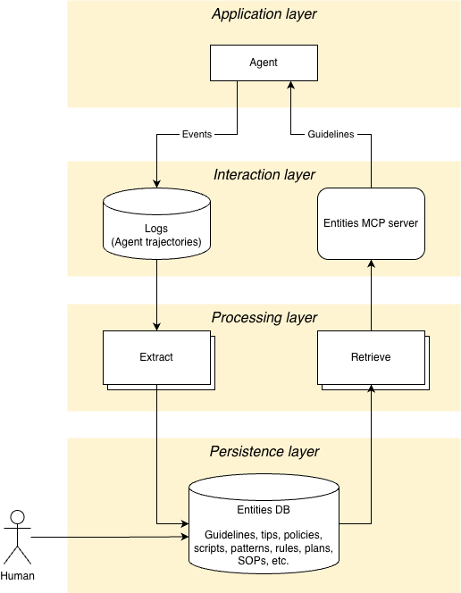

# Kaizen

Self-improving agents through iterations.

Kaizen is a system designed to help agents improve over time by learning from their trajectories. It uses a combination of an MCP server for tool integration, vector storage for memory, and LLM-based conflict resolution to refine its knowledge base.

## Features

- **MCP Server**: Exposes tools to get guidelines and save trajectories.
- **Conflict Resolution**: Intelligently merges new insights with existing guidelines using LLMs.
- **Trajectory Analysis**: Automatically analyzes agent trajectories to generate tips and best practices.
- **Milvus Integration**: Uses Milvus (or Milvus Lite) for efficient vector storage and retrieval.

## Architecture



## Quick Start

### Installation

Prerequisites:
- Python 3.12 or higher
- `uv` (recommended) or `pip`

```bash
git clone <repository_url>
cd kaizen
uv sync && source .venv/bin/activate
```

### Configuration

Set your OpenAI API key:
```bash
export OPENAI_API_KEY=sk-...
```

For detailed configuration options (custom LLM providers, backends, etc.), see [CONFIGURATION.md](CONFIGURATION.md).

### Running the MCP Server

```bash
uv run fastmcp run kaizen/frontend/mcp/mcp_server.py --transport sse --port 8201
```

Verify it's running:
```bash
npx @modelcontextprotocol/inspector@latest http://127.0.0.1:8201/sse --cli --method tools/list
```

**Available tools:**
- `get_entities(task: str, entity_type: str)`: Get relevant entities for a specific task, filtered by type (e.g., 'guideline', 'policy').
- `get_guidelines(task: str)`: Get relevant guidelines for a specific task (backward compatibility alias).
- `save_trajectory(trajectory_data: str, task_id: str | None)`: Save a conversation trajectory and generate new tips.
- `create_entity(content: str, entity_type: str, metadata: str | None, enable_conflict_resolution: bool)`: Create a single entity in the namespace.
- `delete_entity(entity_id: str)`: Delete a specific entity by its ID.

## Tip Provenance

Kaizen automatically tracks the origin of every guideline it generates or stores. Every tip entity contains `metadata` identifying its source:
- `creation_mode`: Identifies how the tip was created (`auto-phoenix` via trace observability, `auto-mcp` via trajectory saving tools, or `manual`).
- `source_task_id`: The ID of the original trace or task that inspired the tip, providing full audibility.

See the [Low-Code Tracing Guide](docs/LOW_CODE_TRACING.md#6-understanding-tip-provenance-metadata) for more details.

## Documentation

- [KAIZEN_LITE.md](KAIZEN_LITE.md) - Lightweight mode via Claude Code plugin (no infra required)
- [CONFIGURATION.md](CONFIGURATION.md) - Detailed configuration options
- [POLICIES.md](docs/POLICIES.md) - Policy support and schema
- [CLI.md](CLI.md) - Command-line interface documentation
- [CLAUDE_CODE_DEMO.md](CLAUDE_CODE_DEMO.md) - Claude Code demo walkthrough

## Development

### Running Tests

```bash
uv run pytest
```

#### Phoenix Sync Tests

Tests for the Phoenix trajectory sync functionality are **skipped by default** since they require familiarity with the Phoenix integration. To include them:

```bash
# Run all tests including Phoenix tests
uv run pytest --run-phoenix

# Run only Phoenix tests
uv run pytest -m phoenix
```

#### End-to-End (E2E) Low-Code Verification

To run the full end-to-end verification pipeline (Agent -> Trace -> Tip):

```bash
KAIZEN_E2E=true uv run pytest tests/e2e/test_e2e_pipeline.py -s
```

See [docs/LOW_CODE_TRACING.md](docs/LOW_CODE_TRACING.md#end-to-end-verification) for more details.
