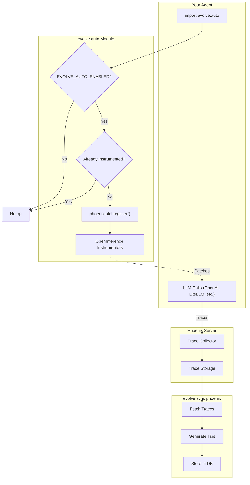

# Evolve Low-Code Tracing Guide

> Enable Phoenix tracing for your LLM agents with minimal code changes.

## Architecture Overview


```mermaid
flowchart TB
    subgraph Agent["Your Agent"]
        A1["import evolve.auto"]
        A2["LLM Calls (OpenAI, LiteLLM, etc.)"]
    end
    
    subgraph Evolve["evolve.auto Module"]
        K1{"EVOLVE_AUTO_ENABLED?"}
        K2{"Already instrumented?"}
        K3["phoenix.otel.register()"]
        K4["OpenInference Instrumentors"]
    end
    
    subgraph Phoenix["Phoenix Server"]
        P1["Trace Collector"]
        P2["Trace Storage"]
    end
    
    subgraph Sync["evolve sync phoenix"]
        S1["Fetch Traces"]
        S2["Generate Tips"]
        S3["Store in DB"]
    end
    
    A1 --> K1
    K1 -->|No| SKIP["No-op"]
    K1 -->|Yes| K2
    K2 -->|Yes| SKIP
    K2 -->|No| K3
    K3 --> K4
    K4 -.->|"Patches"| A2
    A2 -->|"Traces"| P1
    P1 --> P2
    P2 --> S1
    S1 --> S2
    S2 --> S3
```

## Integration

Add one import at the top of your agent:

```python
try:
    import evolve.auto # noqa: F401
except ImportError:
    pass

# Your agent code - all LLM calls are now traced
from openai import OpenAI
client = OpenAI()
response = client.chat.completions.create(...)
```

**Environment variables:**
```bash
export EVOLVE_AUTO_ENABLED=true
export EVOLVE_TRACING_PROJECT=my-agent  # Optional, defaults to "evolve-agent"
export EVOLVE_TRACING_ENDPOINT=http://localhost:6006/v1/traces  # Optional

# For Evolve example scripts only (e.g. examples/low_code/smolagents_demo.py):
export EVOLVE_EXAMPLE_AGENT_MODEL="Azure/gpt-4.1" # Overrides default tips model for agent execution
```

> **Note**: Auto-patching will skip if existing tracing is detected. Use `enable_tracing(force=True)` to override.

## Example: Simple OpenAI Script

Use this when you are tracing **raw API calls** directly using the `openai` library. Evolve will capture the individual inputs and outputs of the LLM.

```python
try:
    import evolve.auto # noqa: F401
except ImportError:
    pass

from openai import OpenAI

client = OpenAI()
response = client.chat.completions.create(
    model="gpt-4",
    messages=[{"role": "user", "content": "Hello!"}]
)
print(response.choices[0].message.content)
```

---

## Example: LiteLLM (Multi-Provider)

Use this when using **LiteLLM** to abstract across multiple providers. Evolve traces the unified call interface.

```python
try:
    import evolve.auto # noqa: F401
except ImportError:
    pass

import litellm

# Call Azure
response = litellm.completion(
    model="Azure/gpt-4",
    messages=[{"role": "user", "content": "What is 2+2?"}]
)

# Call Anthropic
response = litellm.completion(
    model="claude-3-opus-20240229",
    messages=[{"role": "user", "content": "Explain recursion."}]
)

# All calls from any provider are traced!
```

---

## Example: Smolagents (HuggingFace)

Use this for **agentic workflows** built with HuggingFace's `smolagents`. Evolve traces the agent's steps, tool calls, and final answers.

```python
try:
    import evolve.auto # noqa: F401
except ImportError:
    pass

from smolagents import CodeAgent, HfApiModel

model = HfApiModel()
agent = CodeAgent(tools=[], model=model, max_steps=5)

# Agent execution is traced
result = agent.run("What is the capital of France?")
print(result)
```

---

## Example: OpenAI Agents SDK

Use this for the **OpenAI Agents framework** (`agents`). Evolve traces the high-level agent lifecycle, including runs, turns, and tool executions.

```python
try:
    import evolve.auto # noqa: F401
except ImportError:
    pass

from agents import Agent, Runner

agent = Agent(
    name="helper",
    instructions="You are a helpful assistant."
)

runner = Runner()
result = runner.run(agent, "Write a haiku about coding.")
print(result)
```

---

## Testing & Validation

### 1. Start Phoenix Server

```bash
pip install arize-phoenix
phoenix serve
# Server runs at http://localhost:6006
```

### 2. Run Your Agent

```bash
EVOLVE_AUTO_ENABLED=true EVOLVE_TRACING_PROJECT=test-agent python your_agent.py
```

### 3. Verify Traces in Phoenix

```bash
# Check if project exists
curl http://localhost:6006/v1/projects

# Check spans
curl "http://localhost:6006/v1/projects/test-agent/spans?limit=5"
```

### 4. Sync to Evolve

```bash
cd evolve_repo
EVOLVE_BACKEND=filesystem \
EVOLVE_TIPS_MODEL="gpt-4" \
uv run evolve sync phoenix \
    --project test-agent \
    --include-errors
```

### 5. Verify Generated Tips

```bash
EVOLVE_BACKEND=filesystem \
uv run evolve entities list evolve --type guideline
```

### 6. Understanding Tip Provenance (Metadata)

When Evolve generates tips from traced trajectories (or from explicit `save_trajectory` calls), it automatically injects provenance metadata into the resulting `guideline` entities. This helps you track exactly *where* a tip came from and *how* it was created.

```json
{
  "type": "guideline",
  "content": "Always verify the record exists before updating.",
  "metadata": {
    "creation_mode": "auto-phoenix",
    "source_task_id": "0df020ed0bd2e...",
    "source_span_id": "9218e1003f...",
    "category": "optimization"
  }
}
```

*   **`creation_mode`**: Describes the origin of the tip.
    *   `"auto-phoenix"`: Auto-generated from observability traces via `evolve sync phoenix`.
    *   `"auto-mcp"`: Auto-generated when an agent directly calls the Evolve `save_trajectory` MCP tool.
    *   `"manual"`: Explicitly created by a human or agent (e.g., via the `create_entity` MCP tool).
*   **`source_task_id`**: The originating trace ID (for Phoenix) or task ID (for MCP), linking the tip back to the specific execution that inspired it.

---

## End-to-End Verification

Evolve includes a comprehensive E2E verification suite to ensure that tracing and tip generation work correctly across all supported agents.

### Running the E2E Pipeline

You can run the full regression suite using `pytest`:

```bash
uv run pytest -m e2e --run-e2e -s
```

### Running Specific Tests

To test a specific agent framework:

```bash
# Test smolagents
uv run pytest tests/e2e/test_e2e_pipeline.py -k smolagents -m e2e --run-e2e -s

# Test OpenAI Agents
uv run pytest tests/e2e/test_e2e_pipeline.py -k openai_agents -m e2e --run-e2e -s
```

### What It Tests

The pipeline performs the following for each agent:
1.  **Executes the Agent**: Run the agent script (e.g., `smolagents_demo.py`) with auto-instrumentation enabled.
2.  **Verifies Traces**: Checks the Phoenix server for the existence of traces in a unique, timestamped project.
3.  **Generates Tips**: Runs `evolve sync` on the generated traces to verify that tips are successfully created from the agent's execution.

This ensures the entire "Agent -> Traces -> Tips" loop is functional.

---

## Troubleshooting

| Issue | Solution |
| ----- | ---------- |
| `ModuleNotFoundError: evolve.auto` | Install: `pip install -e path/to/evolve_repo` or add to PYTHONPATH |
| No traces appearing | Check `EVOLVE_AUTO_ENABLED=true` is set |
| Wrong project name | Set `EVOLVE_TRACING_PROJECT=your-name` |
| Existing tracer conflict | Use explicit mode with `force=True` |
| Phoenix not running | Start with `phoenix serve` |

---

## Supported Frameworks

Evolve.auto automatically instruments these frameworks when detected:

- **OpenAI** ([Example](../examples/low_code/simple_openai.py)) - ChatCompletion, Completion, Embeddings
- **LiteLLM** ([Example](../examples/low_code/litellm_demo.py)) - All providers (Azure, Anthropic, etc.)
- **Smolagents** ([Example](../examples/low_code/smolagents_demo.py)) - HuggingFace agents
- **OpenAI Agents SDK** ([Example](../examples/low_code/openai_agents_demo.py)) - OpenAI's agent framework
